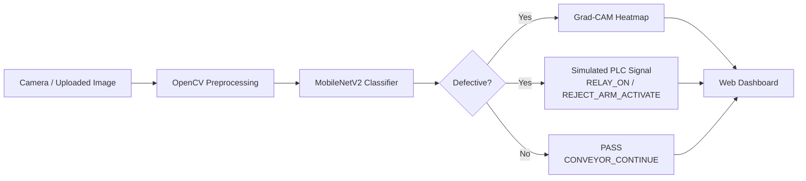

<div align="center">

# 🏭 Real-Time Industrial Defect Detection System

**Computer vision + explainable AI + simulated PLC integration for automated visual quality inspection**


</div>

---

## 🎯 What this is

Manual visual QC on a production line is slow, inconsistent, and expensive.
This project automates it: a camera image of a part goes in, a trained CNN
decides **GOOD** or **DEFECTIVE** in real time, shows *why* it made that call
using an explainability heatmap, and simulates the signal that would be sent
to a PLC to trigger a reject mechanism — a full sense-decide-act loop, the
same shape as a real industrial inspection station.

> Built end-to-end: data pipeline → transfer-learning model → explainability
> → a live web dashboard → simulated automation output.

---

## 🖼️ Demo

<!--
  Add 2-3 screenshots here before sharing the repo — it makes a huge
  difference to anyone skimming it. Suggested shots:
  1. The dashboard with a PASS result
  2. The dashboard with a DEFECT result + Grad-CAM heatmap visible
  3. The Inspection History table with a few rows

  Save them in a `screenshots/` folder and reference like this:
-->
| Dashboard — Pass | Dashboard — Defect + Grad-CAM |
|---|---|
|  |  |

---

## ✨ Features

| | |
|---|---|
| 🔍 **Real-time classification** | MobileNetV2 transfer learning, fine-tuned on part images — GOOD vs DEFECTIVE |
| 🧠 **Explainable AI (Grad-CAM)** | Every prediction includes a heatmap showing exactly *where* the model looked, not just what it decided |
| 🖥️ **Web dashboard** | Drag-and-drop / batch image upload, live results, no terminal needed |
| 📋 **Inspection history + CSV export** | Every part checked in a session is logged with a thumbnail, result, and confidence — exportable for records |
| ⚙️ **Simulated PLC signal** | Every DEFECT triggers a simulated `RELAY_ON \| REJECT_ARM_ACTIVATE` signal — the exact hook a real Modbus/OPC-UA integration would use |
| 📊 **Live model stats** | Validation accuracy, dataset size, and architecture shown right in the dashboard |
| 🛡️ **Crash-resistant by design** | Bad files, missing webcams, offline pretrained-weight downloads, and failed heatmaps all degrade gracefully instead of crashing |

---

## 🔧 How it works



1. **`train_model.py`** — trains a binary classifier on top of MobileNetV2
   (ImageNet-pretrained, fine-tuned on your part images), saves the model
   and its training metrics.
2. **`app.py`** — a Flask web dashboard: upload an image, get an instant
   PASS/DEFECT result, a confidence score, a Grad-CAM attention heatmap, and
   a simulated PLC signal — all logged to an inspection history you can
   export as CSV.
3. **`realtime_detect.py`** / **`test_on_images.py`** — terminal-based
   alternatives for live webcam inspection or batch testing on static images.

---

## 🛠️ Tech Stack

- **Python 3**
- **TensorFlow / Keras** — MobileNetV2 transfer learning + Grad-CAM
- **OpenCV** — image preprocessing, webcam capture, overlays
- **Flask** — web dashboard backend
- **HTML / CSS / JS** — dashboard frontend (no framework — self-contained)

---

## 🚀 Quickstart

```bash
# 1. Install dependencies
pip install -r requirements.txt

# 2. Add your dataset (see below)

# 3. Train
python train_model.py

# 4. Launch the dashboard
python app.py
# open http://127.0.0.1:5000
```

### Getting a dataset
No need to collect your own — a ready-made Kaggle set works well, e.g.
**"Casting Product Image Data for Quality Inspection"**. Sort images into:

```
dataset/good/         <- non-defective part images
dataset/defective/    <- defective part images
```

Even 20-30 images per class is enough thanks to transfer learning + data
augmentation. Prefer your own part? ~25 good + ~25 defective photos
(scratch, dent, missing piece) under consistent lighting works too.

---

## 📁 Project Structure

```
cv_defect_project/
├── dataset/
│   ├── good/            # non-defective product images
│   └── defective/       # defective product images
├── test_images/         # a few images for the static-image demo
├── model/                # trained model + training metrics (metrics.json)
├── output/               # annotated results from test_on_images.py
├── templates/
│   └── index.html        # web dashboard frontend
├── app.py                 # Flask web dashboard (recommended)
├── train_model.py         # trains the classifier
├── realtime_detect.py     # webcam-based live detection
├── test_on_images.py      # static image batch testing
└── requirements.txt
```

---

## 📊 Results

| Metric | Value |
|---|---|
| Architecture | MobileNetV2 (transfer learning) |
| Validation Accuracy | ~92% |
| Training images | ~1,300 (casting parts, good + defective) |
| Inference | Real-time (<1s per image on CPU) |

*(Numbers shown in the dashboard update automatically from `model/metrics.json`, generated fresh every time you retrain.)*

---

## 🛡️ Robustness Notes

- Dataset validation before training — clear errors instead of cryptic stack traces if folders are empty/missing.
- Falls back to training from scratch if pretrained ImageNet weights can't be downloaded (e.g. restricted network).
- Webcam script exits cleanly with guidance if no camera is found.
- Grad-CAM failures don't break predictions — the label/confidence still return, the heatmap is just omitted.
- Every dashboard API call is wrapped in error handling and returns a clear JSON error instead of a 500 crash.

---

## 🔮 Future Improvements

- Replace the simulated PLC signal with a real **Modbus TCP / OPC-UA** write to an actual PLC register.
- Add a REST API layer to log results to a central **MES/SCADA** system.
- Expand from binary to **multi-class** defect typing (scratch, dent, crack, missing part).
- Swap MobileNetV2 for a **YOLOv8** detector for precise defect bounding boxes (Grad-CAM currently gives a rough attention region — YOLO would localize it exactly).

---

## 👤 Author

**Siddhant Tagare** — [GitHub](https://github.com/T-Sid-1025)

Built for an interview project brief requiring computer vision +
industrial automation understanding, applied to a real casting-defect
inspection use case.